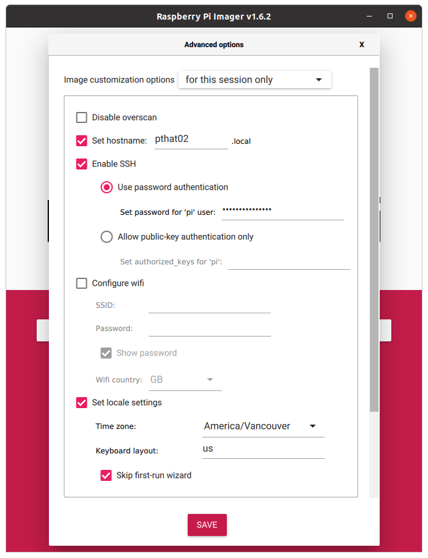
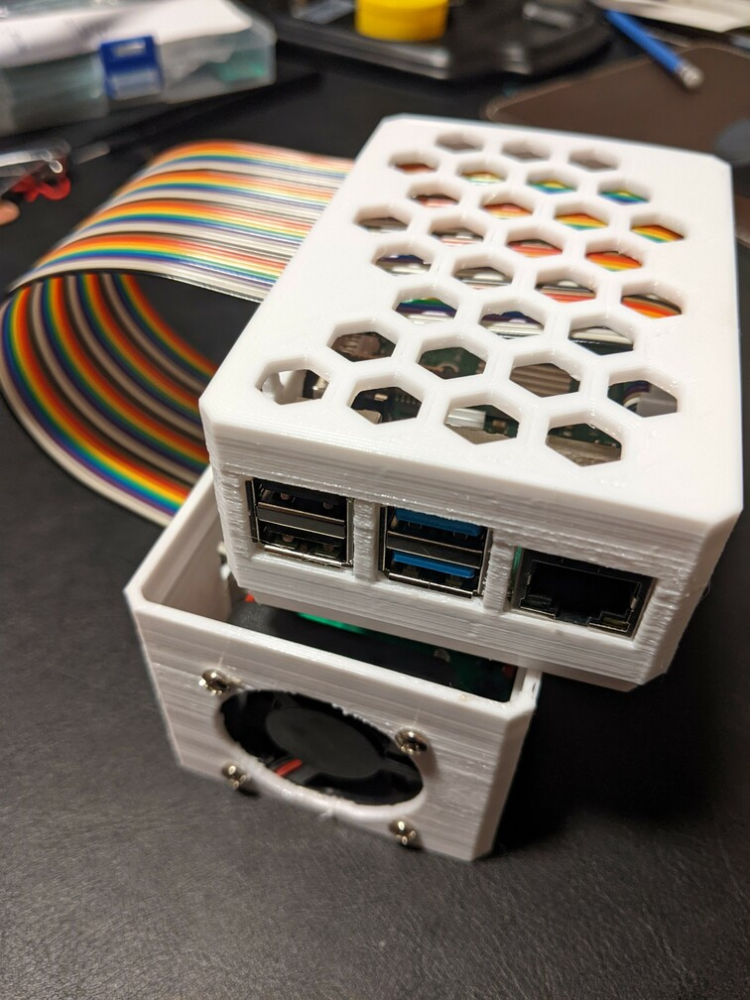

Installation
============

.. _rpi_config:

Raspberry Pi
------------

To use the PTHat, you must first configure a Raspberry Pi. This procedure assumes that you will run the Raspberry Pi headless and connect to it remotely over your network. Follow the instructions to create a MicroSD card with the `Raspberry Pi OS <https://www.raspberrypi.com/software/>`_. More details can be found in the `Raspberry Pi Guide <https://raspberrypi-guide.github.io/getting-started/raspberry-pi-headless-setup>`_. Use the Raspberry Pi imager, and choose the default image.

.. note::
  On Ubuntu, the Imager installed via Snap appears to fail at verification with "Error creating firstrun.sh on FAT partition" [`ref <https://github.com/raspberrypi/rpi-imager/issues/298>`_].   Use the .deb package from the official site.

Insert the MicroSD card (usually with a USB adapter) and select it as the storage. *Before* writing the image, access the advanced options by pressing ``Ctrl+Shift+X``. Set the hostname so that you can uniquely identify the device on your network. Enable SSH with your preferred authentication scheme. For password authentication, you should change the default password for the ``pi`` user (to see and verify the password, enter in a text editor and copy it into the password field). If you will be connecting to the Pi over Wifi, enter your Wifi configuration and set your country. Set your locale settings and keyboard layout. Set the option to skip the first-run wizard.

Click ``Save`` then click ``Write`` to start writing the image to the MicroSD card. Once the image has been writen and verified, eject the MicroSD card and insert it into the Raspberry Pi.

If using an ethernet connection, connect your Raspberry Pi. Power on the Raspberry Pi (usually by plugging in the USB-C charging cable). Wait for a minute until the Pi boots, then connect to it over SSH. On Windows, install the Bonjour service and `PuTTY <https://www.chiark.greenend.org.uk/~sgtatham/putty/>`_. Open a new connection in PuTTY using the username ``pi`` and the hostname that you chose when configuring the image. On Linux, open a terminal and connect with ``ssh pi@pthat02`` (where ``pthat02`` is replaced with the hostname that you chose when configuring the image).

Software
--------

Once connected over SSH, update the OS with

.. code-block:: bash

  $ sudo apt update
  $ sudo apt upgrade

Restart: ``sudo shutdown -r now``. You will have to reconnect over SSH. 

Next, configure the Raspberry Pi hardware. The PTHat communicates with the temperature sensors and ADC for the pressure transducers over SPI. Execute the command ``sudo raspi-config``, then navigate to the Interfaces menu.

Select SPI and enable the SPI kernel module.

Return to the top-level menu and choose Finish. Next, update and configure your Python environment

.. code-block:: bash

  $ python3 -m pip install --upgrade pip
  $ python3 -m pip install spilite

Create a Source directory and clone the pthat repository from Github

.. code-block:: bash

  $ cd ~/
  $ mkdir Source
  $ cd Source
  $ git clone https://github.com/xdylanm/pthat.git

Connecting the PTHat
--------------------

**Shutdown and remove power from the Rasberry Pi. Ensure all cables are disconnected.**

Four parts are required for assembly: the ribbon cable, the base housing (with fan and PTHat board mounted), the sled holding the Raspberry Pi, and the cover. 

Connect the board with the ribbon cable. Feed the female end of the ribbon cable through the slot from the inside of the base housing.

.. note:: 
  The ribbon cable is not keyed and there may be additional space in the connector at either end that will allow the pins to be offset by a position. *Ensure that the male end of the cable is correctly aligned with the header on the board*.
  
.. image:: images/assembly_step2_sm.jpg

Next, feed the female end of the ribbon cable through the slot in the cover. Note that the cutouts for the USB & ethernet ports should be at the same end as the fan.

Attach the female end of the ribbon cable to the header on the Raspberry Pi. 

.. note::
  Ensure that the cable is oriented correctly: when connected, the hat should be aligned with the Raspberry Pi such that the headers would connect if the cable were not present.

Fit the cover over the Raspberry Pi mounted on the sled. Start at the end with the USB & ethernet ports and slide those into the cutouts before bringing the cover down to the top of the sled. Be careful not to force the cover over the audio port or the MicroSD card.

Before inserting the cover into the base housing, the upper and lower halves of the assembly should appear align as shown below

Insert the cover and sled into the base housing. The PTHat module is assembled.

Connect the ethernet cable to the Pi, then connect the power. Feed the power cable (USB-C) up through the underside of the stand and inside the loop of the ribbon cable from the fan side.

The PTHat module should sit in the stand as shown below (ethernet cable disconnected).

Once the Pi has booted, re-connect over SSH. Navigate to the ``~/Source/pthat`` folder and run the following test:

.. code-block:: bash

  $ cd ~/Source/pthat
  $ python3
  >>> from pthat.board import Controller
  >>> hat = Controller()
  [...]
  >>> hat.blink_start()

When executing the last statement, you should see the four status LEDs on the PTHat light up in sequence. You can repeat that command again as necessary to confirm basic operation. Type ``exit()`` when finished to leave the Python shell.

